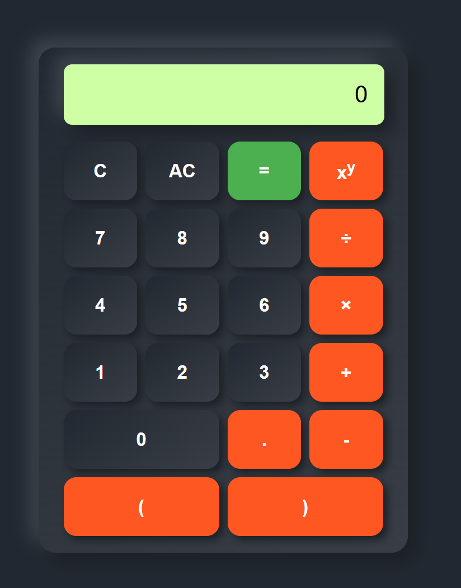

Stack Calcutator
=

Update 1.8:
-

- Фикс проблем с нулем в отсутствии значений в массиве;
- Фикс добавления нескольких точек подряд;
- Добавление возможности вписывать дробные числа, в самом начале с учетом нуля;
- Добавление функциональных скобок и невозможность добавить закрывающуюся скобку, если при ее добавлении, их количество будет превышать количество открытых скобок;
- Добавление ввода с клавиатуры операторов и операндов, а также - удаления всего содержимого калькулятора или только последнего символа и вывод результата;
- Добавление в проект README.md.

| Клавиша         |    Функция    |
| :---:           | :---: |
| '0-9'           | Ввод цифр   |
| '-'             | '-'   |
| '/'             | '/'   |
| Shift + '='     | '+' |
| Shift + '6'     | '^' |
| Shift + '8'     | '*' |
| Shift + '9'     | '(' |
| Shift + '0'     | ')' |
| Enter           | Результат   |
| Backspase       | Удаление последнего символа   |
| Delete          | Удаление всего выражения   |